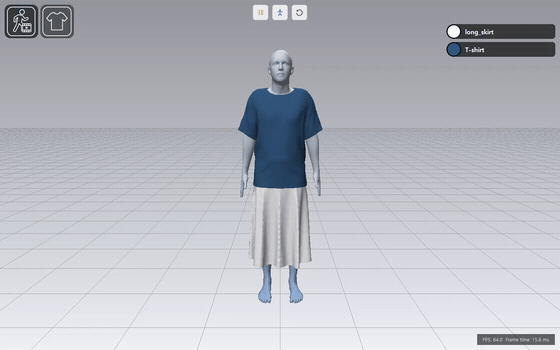
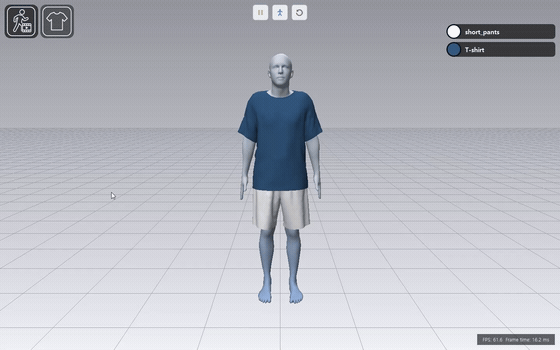
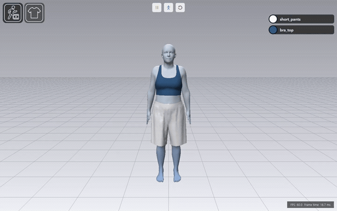
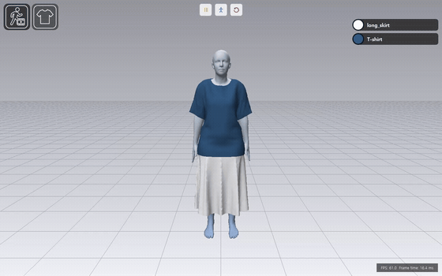
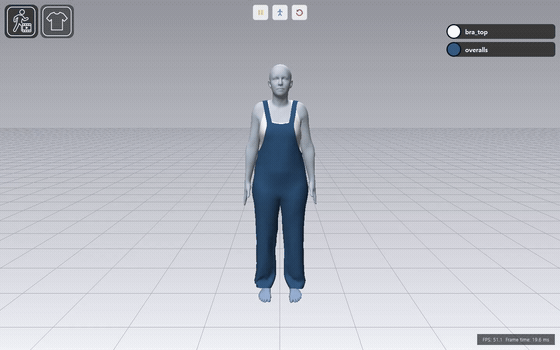

# 실시간 캐릭터-의상 시뮬레이션

C++과 OpenGL로 구현한 PBD(Position-Based Dynamics) 기반 캐릭터-의상 시뮬레이션 프로젝트입니다. <br>SMPL 캐릭터에 의상을 입히고, 캐릭터 모션에 따른 의상의 움직임을 시뮬레이션합니다.

의상 시뮬레이션은 OpenGL compute shader로 수행하며, Qt 기반 UI에서 의상을 선택·배치하고 캐릭터 모션을 재생할 수 있습니다.

**사용 기술:** C++17 · OpenGL · GLSL · Qt 6 · Python · CMake

## 주요 기능 및 사용 방법

### 모션 변환 및 재생
현재 motion은 AMASS에서 제공하는 **CMU 모션 데이터**만 지원합니다.

변환된 모션은 목록에서 선택하면 바로 재생됩니다. <br>
아직 변환되지 않은 모션은 `+` 버튼을 눌러 비동기로 변환할 수 있습니다.

| 모션 카테고리 리스트 | 모션 선택 리스트 | 모션 실행 |
|:---:|:---:|:---:|
| | | |

변환이 완료되면 왼쪽에 모션 카드가 표시됩니다. 카드를 클릭하면 해당 모션 목록으로 이동하고 모션이 재생됩니다.


### 의상 변환 및 배치
Welded Garment Mesh 형태의 OBJ(.obj) 의상 파일만 지원합니다.

변환할 의상 파일을 불러온 뒤 상의, 하의, 전신 중 하나를 선택하여 변환합니다.<br>
변환된 의상은 목록에서 클릭하면 배치할 수 있습니다.

| 의상 리스트 | 의상 카테고리 선택|
|:---:|:---:|
| | |

캐릭터와 의상의 위치를 확인하면서 배치할 의상의 위치와 크기를 조정할 수 있습니다.<br>
`Confirm`을 누르면 `pre-fit` 단계를 거쳐 의상을 착용한 상태로 시뮬레이션이 시작됩니다.


※ 배치 시 캐릭터와 의상이 일부 겹쳐도 됩니다. 겹침은 pre-fit 단계에서 해소됩니다.<br>
※ 색상은 배치 중과 배치 완료 후 모두 변경할 수 있습니다.<br>
※ 현재 최대 두 벌(`Upper,Lower`)의 의상 배치를 지원합니다.<br>

### 캐릭터-의상 시뮬레이션 예시

상단 버튼으로 `시뮬레이션 재생/정지`, `기본 자세로 이동`, `초기화`를 제어할 수 있습니다.

걷기, 달리기 같은 기본적인 동작뿐 아니라 다양한 빠른 모션에서도 육안상 관통 없이 시뮬레이션됩니다.

| 걷기 | 뛰기 |
|:---:|:---:|
| | |
| | |
| | |


| 축구 | 농구 |
|:---:|:---:|
| | |
| 점프 | 아크로바틱 |
| | |
| 발레 1 | 발레 2 |
| | |


## 빌드 및 실행 방법

Windows 환경에서 소스를 빌드하여 실행합니다.

<details>
<summary>환경 준비 및 실행 절차</summary>

### 실행 환경

- Windows x64, OpenGL 4.6 지원 GPU 및 드라이버
- Visual Studio 2022 C++ 개발 도구, CMake 3.21 이상, Qt 6.11.1 (`msvc2022_64`), GLM (`x64-windows`)
- Python 3.10, NumPy, SciPy, PyTorch, smplx, Chumpy

Python 환경은 `envs/cloth-sim/`, vcpkg와 GLM은 저장소 루트의 `vcpkg/`에 준비합니다.

### 데이터 다운로드

아래 데이터는 저장소에 포함되어 있지 않으므로 별도로 다운로드해야 합니다. SMPL과 AMASS는 회원가입 및 로그인이 필요합니다.

| 데이터 | 다운로드 및 배치 위치 |
|---|---|
| SMPL 캐릭터 모델 | [SMPL Downloads](https://smpl.is.tue.mpg.de/download.php)에서 Python용 neutral·male·female 모델을 받아 `data/sources/smpl/models/`에 배치합니다. |
| CMU 모션 | [AMASS Downloads](https://amass.is.tue.mpg.de/download.php)에서 CMU 데이터를 받아 압축을 풀고, `.npz` 파일이 `data/sources/amass/CMU/` 아래에 있도록 배치합니다. |
| 의상 모델 | [CLO-SET CONNECT](https://connect.clo-set.com/) 등에서 준비한 Welded Garment Mesh OBJ 파일을 `data/sources/garments/`에 배치합니다. |

모션 변환에는 AMASS에서 제공하는 CMU `.npz` 데이터를 사용합니다. CMU 원본 사이트의 ASF/AMC 파일은 지원하지 않습니다. SMPL 모델 파일명은 [ProjectPaths.h](simulation_app/src/app/ProjectPaths.h)에 맞춥니다.

### 기본 포즈 생성

첫 실행 전에 neutral SMPL 모델로 초기 A-pose를 생성해야 합니다. 저장소 루트에서 PowerShell로 아래 명령을 한 번 실행합니다.

```powershell
.\envs\cloth-sim\python.exe `
    .\simulation_app\tools\motion_converter\convert_smpl_default_pose.py `
    --model .\data\sources\smpl\models\basicmodel_neutral_lbs_10_207_0_v1.1.0.pkl `
    --output .\data\runtime_assets\motions\init\a_pose.motion
```

생성된 `a_pose.motion`은 프로그램 시작과 기본 포즈 복귀에 사용됩니다.

### 빌드 및 실행

저장소 루트에서 순서대로 실행합니다. Qt 경로는 설치 위치에 맞게 수정합니다.

```powershell
cd simulation_app

$cmake = "C:\QtOpenSource\Tools\CMake_64\bin\cmake.exe"
$vcpkgToolchain = (Resolve-Path ..\vcpkg\scripts\buildsystems\vcpkg.cmake).Path

& $cmake `
    -S . `
    -B build `
    -G "Visual Studio 17 2022" `
    -A x64 `
    "-DCMAKE_PREFIX_PATH=C:\QtOpenSource\6.11.1\msvc2022_64" `
    "-DCMAKE_TOOLCHAIN_FILE=$vcpkgToolchain"

& $cmake --build build --config Debug

cd build\Debug
.\simulation_app.exe
```

</details>

## 에셋 출처

- [SMPL](https://smpl.is.tue.mpg.de/) — 캐릭터 모델.
- [AMASS](https://amass.is.tue.mpg.de/) — 캐릭터 모션 데이터.
- [CMU Motion Capture Database](https://mocap.cs.cmu.edu/) — 사용한 CMU 모션의 원본 출처.
- [CLO-SET CONNECT](https://connect.clo-set.com/) — 의상 모델.
